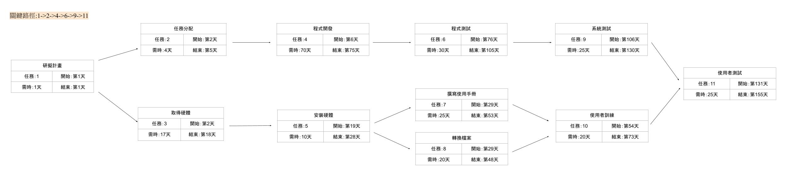

# C108118222_蘇裕凱_hw2.md
|任務|說明|天數|前置任務|
|:---:|:---:|:---:|:---:|
|**1**|研擬計畫|1|-|
|**2**|任務分配|4|1|
|**3**|取得硬體|17|1|
|**4**|程式開發|70|2|
|**5**|安裝硬體|10|3|
|**6**|程式測試|30|4|
|**7**|撰寫使用手冊|25|5|
|**8**|轉換檔案|30|5|
|**9**|系統測試|25|6|
|**10**|使用者訓練|20|7,8|
|**11**|使用者測試|25|9,10|

### (1)關鍵路徑 1->2->4->6->9->11
### (2)PERT/CPM

### (3)甘特圖

